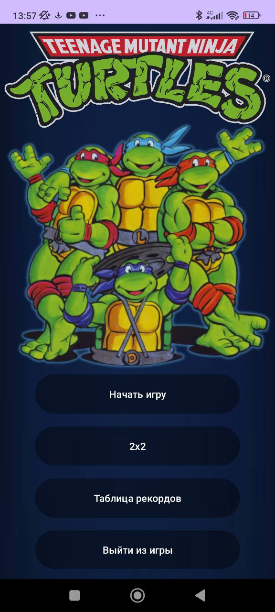
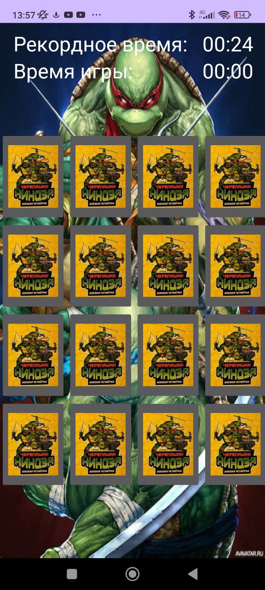

# This is my Memory Mobile Game (Android)
## TMNT 2003 Cards
### There are 4 modes in this game (2x2, 3x3, 4x4, 5x5), record table (record times of each mode).
### Written using Java in Android Studio.
### Language of interface: Russian.
## Interface of main menu:

## Interface of game table:
